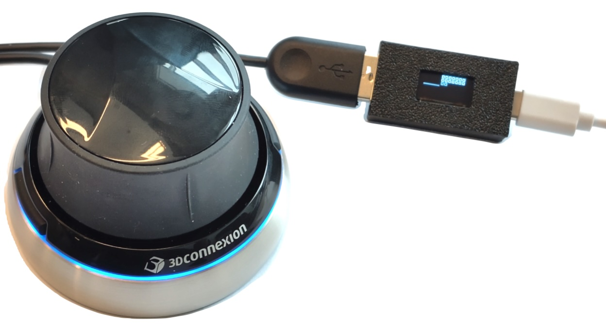
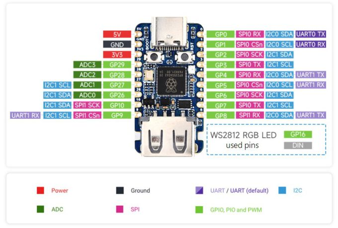
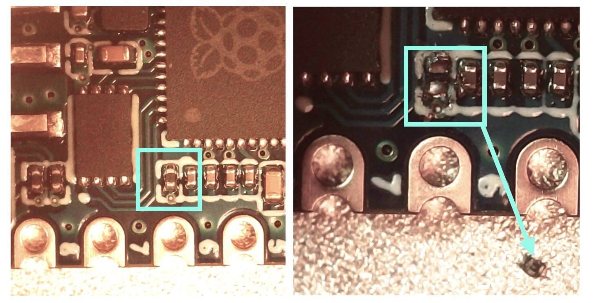
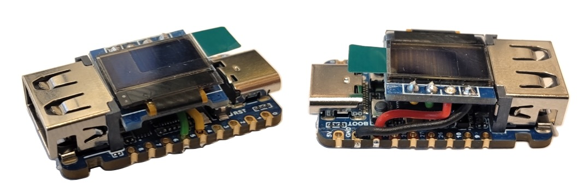
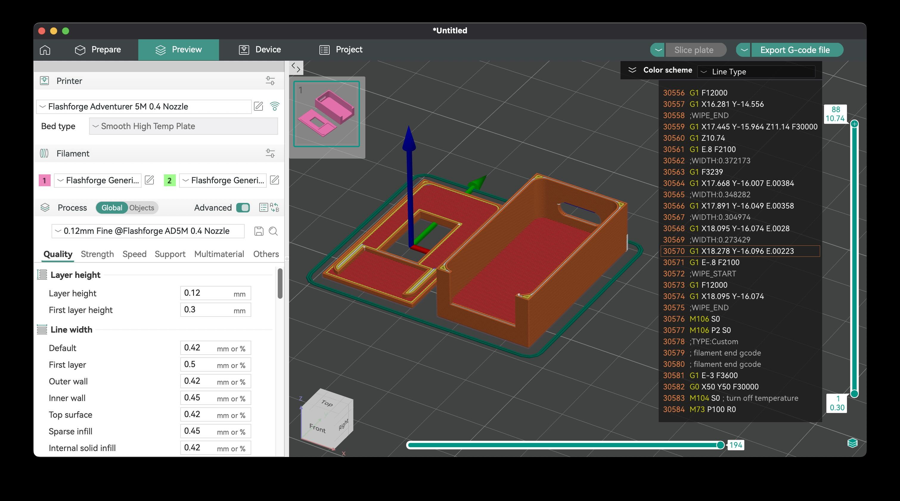
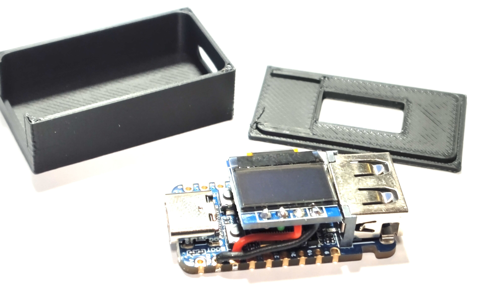

# USB2MIDI — Universal USB HID to USB-MIDI Converter

A firmware for the [**Waveshare RP2350-USB-A**](https://www.waveshare.com/wiki/RP2350-USB-A) board that converts USB HID devices (SpaceMouse, gamepads, joysticks, FPV controllers, or any unknown HID device) into USB-MIDI output. Device mappings are configurable via JSON files on LittleFS — no reflashing needed to remap axes or buttons.



---

## Features

- **USB-A host** — connects HID devices via pio-usb on GP12/GP13
- **Composite USB-C** — presents simultaneously as USB-MIDI device and CDC serial port
- **Multi-device** — up to 4 simultaneous HID devices, each on its own MIDI channel
- **Configurable mappings** — per-device JSON files on LittleFS (axis CC, invert, scale, deadzone, note base)
- **Generic fallback** — unknown devices auto-mapped to CC30–CC37 on MIDI channel 4
- **OLED display** — SSD1306 64×32 showing axis bars and button dots at 5fps
- **Status LED** — WS2812B on GP16 showing connection and data state
- **Rich debug output** — CDC serial shows device mount/unmount, VID/PID, config loaded, axis values, CC output

---

## Hardware



### Board: Waveshare RP2350-USB-A

| Feature | Details |
|---------|---------|
| MCU | RP2350A |
| USB-C | Native USB — CDC serial + USB-MIDI (composite) |
| USB-A | pio-usb host on GP12 (D+) / GP13 (D−) |
| Status LED | WS2812B RGB on GP16 |
| Clock | 120 MHz |
| Flash | 2MB |

### Required Hardware Fix — Desolder R13

**The board cannot work as a USB host without this modification.**

The RP2350-USB-A ships with a 1.5 kΩ resistor R13 permanently pulling D+ high on the USB-A port. This causes pio-usb to see a phantom device and prevents real device detection.

**R13 is located on the underside of the board**, the resistor closest to pin 1 of the RP2350 chip near the USB-A connector.



To remove it:
1. Use a fine soldering iron tip or hot-air station
2. Touch both pads simultaneously — the resistor will slide off
3. Verify with a multimeter: D+ (GP12) should read 0V at idle with no device connected

After removal, devices will be detected correctly on both boot and hot-plug.

> **Note:** After removing R13, the USB-A port can no longer act as a USB device — only as a host. This is the intended configuration.

### OLED Display Wiring — SSD1306 64×32

Connect to **I2C0** (Wire) on the RP2350:

| OLED Pin | GPIO |
|----------|------|
| SDA | GP4 |
| SCL | GP5 |
| VCC | 3.3V |
| GND | GND |

I2C address: `0x3C`.

> **Critical:** Use `Wire` (I2C0), **not** `Wire1`. Using Wire1 on GP4/GP5 causes a silent hang at startup.



### Status LED

The WS2812B is onboard at GP16. No external wiring needed. Driven by direct GPIO bit-bang (no PIO library) to avoid conflicts with pio-usb.

| Colour | Meaning |
|--------|---------|
| Red (steady) | Powered, waiting for USB-A device |
| Cyan flash | Device just mounted |
| Blue (steady) | Device connected, idle |
| Green flash | MIDI data being sent |
| Orange flash | Device disconnected |

---

## Box design

A small box has been designed using OpenSCAD that fits the board + the tiny OLED mounted on top.



The [design files](design/waveshareRP2350box.scad) can be used to generate a printable STL.




## Firmware Architecture

```
Core 0 (main loop)          Core 1 (USB host)
─────────────────────       ─────────────────
USB-MIDI output             pio-usb task loop
CDC serial debug            tuh_mount_cb
OLED update (5fps)          tuh_umount_cb
NeoPixel update             tuh_hid_report_received_cb
LittleFS config load
Event queue drain ◄────────── Event queue push
Spin-lock shared state ◄──► Spin-lock shared state
```

All shared device state is protected by a hardware spin-lock. Core 1 never calls Serial, Wire, or the NeoPixel driver — it only pushes events to a ring buffer that core 0 drains in `loop()`. The NeoPixel must only be called from core 0 — calling `show()` from core 1 causes a CPU halt on RP2350.

---

## Project Structure

```
src/
  main.cpp              — dual-core setup, USB callbacks, MIDI/OLED/LED output
  config.cpp            — LittleFS JSON loader/saver, per-device defaults
  device_parsers.cpp    — HID report parsers for each device type

include/
  hid_device.h          — HIDDeviceState, HIDDevice, MAX_DEVICES
  device_registry.h     — VID/PID classification, DeviceType enum, parser dispatch
  config.h              — DeviceConfig struct, axis config, config_load/save
  mapping.h             — axis_to_cc() with deadzone, invert, scale
  oled.h                — SSD1306 64×32 driver, Wire (I2C0), 5fps
  neo.h                 — WS2812B bit-bang driver, GP16, core 0 only
  usbh_helper.h         — USBHost object + rp2040_configure_pio_usb()

lib/
  pio_usb/              — vendored Pico-PIO-USB v0.5.3

data/
  mappings/
    046D_C628.json      — SpaceMouse Pro (Logitech VID)
    046D_C216.json      — Logitech F310 XInput mode
    046D_C21D.json      — Logitech F310 DirectInput mode
    044F_B305.json      — Thrustmaster Top Gun Fox 2 Pro Shock
    0483_572B.json      — BetaFPV Joystick
```

---

## Building and Flashing

### Prerequisites

- VSCode with PlatformIO extension
- earlphilhower arduino-pico core (installed automatically via platformio.ini)

### Build and flash

```bash
pio run -e usb2midi --target upload
```

This flashes firmware and LittleFS (including all JSON mapping files) in one step.

### Flash LittleFS only

If you only changed JSON mapping files and don't want to reflash firmware:

```bash
pio run -e usb2midi --target buildfs
picotool uf2 convert .pio/build/usb2midi/littlefs.bin littlefs.uf2 \
  --family rp2350-non-secure --offset 0x10180000
```

Then hold BOOTSEL, plug in USB-C, and drag `littlefs.uf2` to the RPI-RP2 drive.

> **Tip:** The simpler route is always `pio run --target upload` — it flashes both together.

---

## Supported Devices and Default MIDI Mappings

| Device | VID:PID | MIDI Ch | CC Range | Note Base | Deadzone |
|--------|---------|---------|----------|-----------|----------|
| SpaceMouse (all variants) | 256F:* / 046D:C62x | 1 | CC1–CC6 | C2 (36) | 800 |
| F310 XInput | 046D:C216 | 2 | CC14–CC17 | C3 (48) | 1500 |
| F310 DirectInput | 046D:C21D | 2 | CC14–CC19 | C3 (48) | 1000 |
| Thrustmaster Fox 2 Pro Shock | 044F:B305 | 3 | CC20–CC23 | C4 (60) | 600 |
| BetaFPV Joystick | 0483:572B | 4 | CC30–CC37 | C5 (72) | 500 |
| Generic / unknown | any | 4 | CC30–CC37 | C5 (72) | 500 |

### SpaceMouse axis layout

| Axis | CC | Movement |
|------|----|---------|
| A0 | CC1 | TX — left/right |
| A1 | CC2 | TY — up/down |
| A2 | CC3 | TZ — forward/back |
| A3 | CC4 | RX — pitch |
| A4 | CC5 | RY — roll |
| A5 | CC6 | RZ — yaw |

All axes map to CC 0–127, rest position = 64.

### Thrustmaster Top Gun Fox 2 Pro Shock (044F:B305)

Layout confirmed from HID descriptor (mac-hid-dump):

| Field | Bytes | Format |
|-------|-------|--------|
| Buttons 1–7 | bits 0–6 of byte 0 | active high |
| Padding | bits 7–19 (always 0x3C in byte 1) | — |
| Hat switch | upper nibble of byte 2 | 0=N, 1=NE … 7=NW, 8–F=centre |
| X axis | byte 3 | int8, -128..+127 |
| Y axis | byte 4 | int8, -128..+127 |
| Rz/rudder | byte 5 | int8, -128..+127 |
| Slider | byte 6 | uint8, 0..255 |

Hat directions decoded to virtual buttons 8–11 (N/E/S/W). Joystick axes are uncalibrated — physical rest is not at zero. Use deadzone ≥ 600.

### BetaFPV Joystick (0483:572B)

Layout confirmed from HID descriptor (mac-hid-dump):

| Field | Bytes | Format |
|-------|-------|--------|
| X, Y, Z, Rx, Ry, Rz, Slider×2 | 0–15 | uint16 LE, range 0–2047, centre 1024 |
| 16 buttons | 16–17 | bitmask |

### F310 in XInput mode (046D:C216)

The F310 in XInput mode (switch on back set to X) sends a compact 8-byte HID report rather than the standard 20-byte XInput format. Layout:

| Byte | Field |
|------|-------|
| 0 | Left stick X (uint8, centre 0x80) |
| 1 | Left stick Y (uint8, centre 0x80) |
| 2 | Right stick X (uint8, centre 0x80) |
| 3 | Right stick Y (uint8, centre ~0x7F) |
| 4 | Buttons low (hat in low nibble, face buttons in high — bit 3 masked, mode LED) |
| 5 | Buttons high |
| 6–7 | Constants (ignored) |

Switch the F310 to D position (DirectInput mode) for full 6-axis access including triggers.

---

## JSON Mapping Files

Each recognised device can have a JSON file at `/mappings/<VID>_<PID>.json` on LittleFS. Filename must be uppercase 4-digit hex. If no file exists, built-in defaults are used.

### Schema

```json
{
  "_comment": "Human-readable description",
  "name":       "Display name (shown in serial debug)",
  "midi_ch":    1,
  "cc_base":    1,
  "note_base":  36,
  "note_vel":   100,
  "deadzone":   800,
  "axes": [
    { "cc": 1, "invert": false, "scale": 1.0, "_name": "axis label" }
  ]
}
```

### Fields

| Field | Type | Description |
|-------|------|-------------|
| `name` | string | Shown in serial debug output |
| `midi_ch` | 1–16 | MIDI channel for all output from this device |
| `cc_base` | 0–127 | Default CC for axis[0] if `cc` not specified |
| `note_base` | 0–127 | MIDI note for button[0]; button[n] = note_base + n |
| `note_vel` | 0–127 | Note On velocity |
| `deadzone` | 0–32767 | Axis deadzone in internal ±32767 units |
| `axes[n].cc` | 0–127 | Override CC for axis n |
| `axes[n].invert` | bool | Invert axis direction |
| `axes[n].scale` | float | Multiply axis value before mapping |

---

## Adding Support for a New Device

### Step 1 — Get the HID report descriptor

Plug the device into your Mac and use **mac-hid-dump**:

```bash
# Download from https://github.com/todbot/mac-hid-dump/releases
./mac-hid-dump
```

Copy the hex bytes for your device and paste into the online parser at **https://eleccelerator.com/usbdescreqparser/** — select "USB HID Report Descriptor". This gives a complete human-readable breakdown of every field: bit width, logical min/max, usage (X axis, Y axis, Hat Switch, Slider, buttons etc.).

This is the single most important step — it eliminates all guesswork. Every field is precisely defined.

### Step 2 — Note the VID:PID

The serial debug output shows it on mount:

```
[+] Mount   dev=1  ABCD:1234  Generic
    HID instance count = 1
```

### Step 3 — Classify the device

Add to `device_registry.h`:

```cpp
#define VID_MY_BRAND    0xABCDu
#define PID_MY_DEVICE   0x1234u

// Add to DeviceType enum:
DEV_MY_DEVICE,

// Add to classify_device():
if (vid == VID_MY_BRAND && pid == PID_MY_DEVICE) return DEV_MY_DEVICE;

// Add to device_type_name():
case DEV_MY_DEVICE: return "MyDevice";
```

Add parser declaration and dispatch to `parse_report()` in the same file.

### Step 4 — Write the parser

Add to `device_parsers.cpp`, following the descriptor exactly:

```cpp
bool parse_my_device(HIDDeviceState &s, const uint8_t *report, uint16_t len) {
    if (len < N) return false;      // minimum expected length from descriptor
    s.axis_count   = N_AXES;
    s.button_count = N_BUTTONS;

    // Example: uint16 LE centred at 32768
    auto u16c = [](const uint8_t *b) -> int16_t {
        return (int16_t)((uint16_t)b[0] | ((uint16_t)b[1] << 8)) - 32768;
    };
    s.axis[0] = u16c(report + 0);
    s.axis_changed[0] = true;

    // Buttons bitmask
    uint32_t cur = report[N];
    s.buttons_changed = cur ^ s.buttons;
    s.buttons = cur;
    return true;
}
```

#### Parser helper reference

```cpp
// int16 LE signed (SpaceMouse style, range ±32767)
int16_t read_i16(const uint8_t *p) {
    return (int16_t)((uint16_t)p[0] | ((uint16_t)p[1] << 8));
}

// uint16 LE centred at 32768 → signed (most gamepad sticks)
int16_t u16c(const uint8_t *b) {
    return (int16_t)((uint16_t)b[0] | ((uint16_t)b[1] << 8)) - 32768;
}

// uint8 centred at 0x80 → int16 (compact 8-bit axis)
int16_t stick8(uint8_t b) {
    return (int16_t)((int32_t)(b - 0x80) * 256);
}

// uint8 int8 signed → int16 (Thrustmaster style)
int16_t axis_int8(uint8_t b) {
    return (int16_t)((int8_t)b) * 256;
}

// 11-bit unsigned centred at 1024 → int16 (BetaFPV style)
int16_t axis11(const uint8_t *b) {
    uint16_t raw = (uint16_t)b[0] | ((uint16_t)b[1] << 8);
    return (int16_t)(((int32_t)raw - 1024) * 32);
}

// Hat switch nibble → virtual buttons in bits 8–11
uint8_t hat = report[n] & 0x0F;
if (hat <= 7) {
    if (hat==7||hat==0||hat==1) cur |= (1u << 8);   // N
    if (hat==1||hat==2||hat==3) cur |= (1u << 9);   // E
    if (hat==3||hat==4||hat==5) cur |= (1u << 10);  // S
    if (hat==5||hat==6||hat==7) cur |= (1u << 11);  // W
}
```

### Step 5 — Add default config

In `config.cpp`, add a case to the name switch and the defaults switch:

```cpp
case DEV_MY_DEVICE: snprintf(cfg.name, sizeof(cfg.name), "MyDevice"); break;

case DEV_MY_DEVICE:
    cfg.midi_ch=5; cfg.cc_base=40; cfg.note_base=84; cfg.deadzone=500; break;
```

Also add the inline defaults to the `switch(type)` block in `tuh_mount_cb` in `main.cpp`.

### Step 6 — Create the JSON mapping file

Create `data/mappings/ABCD_1234.json`:

```json
{
  "_comment": "MyDevice (ABCD:1234)",
  "name":      "MyDevice",
  "midi_ch":   5,
  "cc_base":   40,
  "note_base": 84,
  "note_vel":  100,
  "deadzone":  500,
  "axes": [
    { "cc": 40, "invert": false, "scale": 1.0, "_name": "X" }
  ]
}
```

### Step 7 — Flash and test

```bash
pio run -e usb2midi --target upload
```

Expected serial output:

```
[+] Mount   dev=1  ABCD:1234  MyDevice
    "MyDevice"  ch=5  cc_base=40  note_base=84  [JSON]
[MyDevice ch5] A0:  +0->64
```

---

## Known Device Quirks

### XInput devices (F310 C216, Xbox 360 controllers)

XInput uses `bInterfaceClass=0xFF` (vendor-specific) rather than `0x03` (HID). TinyUSB's HID driver does not always claim these interfaces. The F310 in XInput mode happens to work because its interface is claimed by the HID driver anyway. Pure XInput devices (Xbox 360 controllers, Guitar Hero guitars with VID `1430`) are **not supported** by the current TinyUSB version — they require a vendor class driver that is incompatible with the pico-sdk's bundled TinyUSB. Options: upgrade TinyUSB, or use a separate Arduino with the Felis USB_Host_Shield_2.0 library feeding MIDI into the RP2350.

### F310 — mode LED bit

In XInput mode, bit 3 of the button byte is always set (the Xbox guide/mode LED). The parser masks this out with `& ~0x08u`.

### SpaceMouse — dual report IDs

The SpaceMouse sends separate reports for translation (ID `0x01`) and rotation (ID `0x02`). Both are accumulated into the same `HIDDeviceState`. A single `loop()` iteration may process only 3 of the 6 axes — this is normal.

### Thrustmaster Fox 2 Pro Shock — uncalibrated axes

The physical stick centre is not at the mathematical midpoint of the axis range. The axes report approximately -17000 (X) at physical rest rather than 0. The deadzone absorbs this. The byte 1 constant `0x3C` is structural padding from the 13-bit padding field after the 7 button bits — not a device ID.

### NeoPixel — core 0 only

Calling `Adafruit_NeoPixel::show()` from core 1 causes a CPU halt on RP2350 (confirmed upstream issue). This firmware uses a direct GPIO bit-bang driver with no PIO library, and all LED calls are made from core 0 only.

### OLED — 5fps rate limit

The SSD1306 `display()` call sends 256 bytes over I2C, blocking for ~5ms. The rate is capped at 5fps (200ms interval) to keep this to 2.5% of core 0 time. The USB device stack is IRQ-driven and is not affected by this brief block.

---

## Troubleshooting

**No device detected on USB-A** — R13 has not been removed. Measure D+ (GP12) at idle: if it reads 3.3V, R13 is still present.

**Device lights up but no MIDI output** — Check serial debug. If `HID instance count = 0`, the device uses a non-HID class (XInput). If arming succeeds but no data flows, check the parser's minimum length check against the actual report size shown in the raw dump.

**`[default]` shown in serial instead of `[JSON]`** — The JSON file was not found. Filename must be `<VID>_<PID>.json` with 4-digit uppercase hex. Reflash with `pio run --target upload` to update LittleFS.

**OLED not working / firmware hangs at startup** — SDA must be on GP4 and SCL on GP5. Using Wire1 instead of Wire, or swapping SDA/SCL, causes a silent hang at `Wire.begin()`.

**CDC works but USB host stops after adding a library** — Check whether the new library uses PIO. pio-usb requires PIO state machines. The NeoPixel driver in this firmware uses GPIO bit-bang specifically to avoid PIO conflicts. If a new library claims PIO resources, move it to PIO1 or find an alternative.

**Axes are all wrong / mixed up** — Run mac-hid-dump and parse the descriptor at eleccelerator.com before writing the parser. Do not guess bit widths from live data alone — the descriptor gives the exact field sizes, logical ranges, and byte offsets.